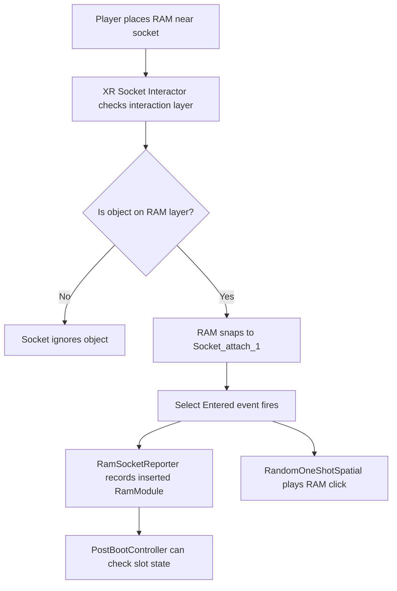
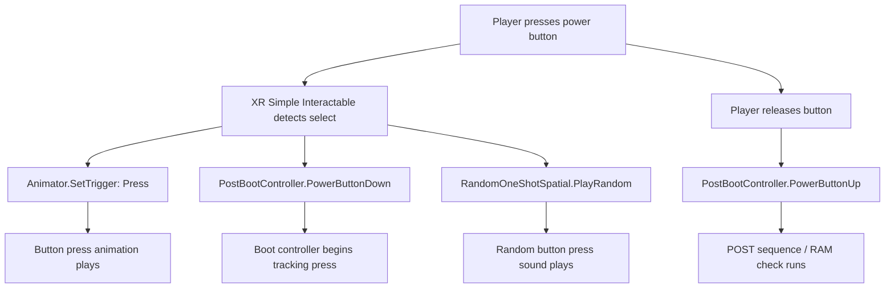

# 05 Interaction setup

## Interaction Setup

This page explains how the main VR interactions are set up in **RAMSim 2.0**.

The project uses the **Pico XR Interaction Setup** as the base for player movement, hand/controller interaction, grabbing, and object interaction.

### Pico XR Interaction Setup

The Pico XR interaction setup was used as the base interaction system for the project.

This provided:

* VR camera/player rig
* left and right controller interaction
* XR grabbing support
* interaction events
* basic controller input
* compatibility with the Pico headset

### Disabled interaction features

Some default interaction features were disabled because they were not needed for this game.

Disabled features included:

* grab move
* teleportation
* climb
* gaze interactor
* vignetting / comfort tunnel vision

These features were disabled to keep the player focused on the RAM puzzle rather than navigating around the whole room.

The important actions in this version are:

* picking up RAM sticks
* placing RAM sticks into motherboard slots
* pressing the power button
* reading the motherboard feedback
* watching the monitor for the final boot result

### Basic interaction loop

```
Player picks up RAM
↓
Player inserts RAM into motherboard slot
↓
Socket detects the RAM
↓
Audio feedback plays
↓
Player presses power button
↓
POST lights run
↓
Game checks RAM configuration
↓
Computer either fails or boots
```

***

## RAM Grab Interaction

Each RAM stick is set up as a grabbable VR object.

The RAM sticks use:

* `Rigidbody`
* `Box Collider`
* `XR Grab Interactable`
* `RamModule`
* `ResettableRam`
* attach points for hand positioning

The `XR Grab Interactable` allows the player to pick up, hold, move, rotate, release, and throw the RAM sticks.

```
RAM Stick
├── Rigidbody
├── Box Collider
├── XR Grab Interactable
├── Attach_point
├── Attach_point (1)
├── RamModule
└── ResettableRam
```

### RAM stick Rigidbody settings

The RAM sticks use a Rigidbody so they behave like physical objects in VR.

```
Rigidbody
├── Mass: 0.5
├── Drag: 4
├── Angular Drag: 6
├── Automatic Center Of Mass: On
├── Automatic Tensor: On
├── Use Gravity: On
├── Is Kinematic: Off
├── Interpolate: Interpolate
└── Collision Detection: Continuous Dynamic
```

These settings help the RAM sticks feel more controlled when picked up and dropped.

The higher drag and angular drag stop the RAM sticks from flying around too much. Continuous Dynamic collision detection helps with fast-moving physics objects and makes the RAM less likely to miss collisions.

### RAM stick collider settings

Each RAM stick uses a `Box Collider`.

```
Box Collider
├── Is Trigger: Off
├── Provides Contacts: Off
├── Material: None
├── Center:
│   ├── X: 8.943425e-08
│   ├── Y: -5.467788e-05
│   └── Z: 0.0002133932
└── Size:
    ├── X: 8.186608e-05
    ├── Y: 0.001468061
    └── Z: 0.0005074235
```

The collider is not a trigger because the RAM needs to behave as a physical object.

The collider is used for:

* grabbing
* physics collisions
* socket placement
* preventing the RAM from passing through objects

### RAM stick XR Grab Interactable settings

Each RAM stick uses `XR Grab Interactable`.

```
XR Grab Interactable
├── Interaction Manager: XR Interaction Manager
├── Interaction Layer Mask: Everything
├── Distance Calculation Mode: Collider Position
├── Select Mode: Single
├── Focus Mode: Single
├── Movement Type: Kinematic
├── Retain Transform Parent: On
├── Track Position: On
├── Smooth Position: On
├── Smooth Position Amount: 8
├── Tighten Position: 0.1
├── Track Rotation: On
├── Smooth Rotation: On
├── Smooth Rotation Amount: 8
├── Tighten Rotation: 0.1
├── Track Scale: On
├── Smooth Scale: Off
├── Throw On Detach: On
├── Throw Smoothing Duration: 0.25
├── Throw Velocity Scale: 1.5
├── Throw Angular Velocity Scale: 1
├── Force Gravity On Detach: Off
├── Attach Transform: Attach_point
├── Secondary Attach Transform: Attach_point (1)
├── Use Dynamic Attach: On
├── Match Position: On
├── Match Rotation: On
├── Snap To Collider Volume: On
├── Reinitialize Every Single Grab: On
├── Attach Ease In Time: 0.15
└── Attach Point Compatibility Mode: Default Recommended
```

### Why these grab settings were used

The RAM sticks are oversized compared to real RAM, so the grab setup needed to feel stable and predictable.

Important settings include:

* `Movement Type: Kinematic`: makes the RAM follow the controller more reliably while being held.
* `Smooth Position` and `Smooth Rotation`: make the movement feel less jittery.
* `Attach Transform: Attach_point`: controls where the RAM sits in the player's hand.
* `Secondary Attach Transform: Attach_point (1)`: gives the object a second grab reference point.
* `Use Dynamic Attach`: helps the RAM attach naturally depending on where the player grabs it.
* `Throw On Detach`: allows the RAM to keep some motion when released.

### RAM module settings

Each RAM stick also has a `RamModule` script.

Example from one RAM stick:

```
RamModule
├── Module Name: RAM_16_C_OK
├── Capacity: GB16
└── Is Faulty: Off
```

This information is read by the `PostBootController` when the player presses the power button.

***

## RAM Socket Interaction

The motherboard RAM slots are set up using `XR Socket Interactor`.

Each socket accepts RAM sticks, records which RAM stick is inserted, and plays a randomised insertion sound.

The four main RAM sockets are:

```
Motherboard
└── RAM_Sockets
    ├── DIMM_A1
    ├── DIMM_A2
    ├── DIMM_B1
    └── DIMM_B2
```

Each socket uses:

* `XR Socket Interactor`
* `RamSocketReporter`
* `Audio Source`
* `RandomOneShotSpatial`

```
DIMM_A2
├── XR Socket Interactor
├── RamSocketReporter
├── Audio Source
└── RandomOneShotSpatial
```

### XR Socket Interactor settings

The `XR Socket Interactor` allows the RAM stick to snap into the motherboard slot.

Example settings from `DIMM_A2`:

```
XR Socket Interactor
├── Interaction Manager: XR Interaction Manager
├── Interaction Layer Mask: RAM
├── Attach Transform: Socket_attach_1
├── Disable Visuals When Blocked In Group: On
├── Starting Selected Interactable: None
├── Keep Selected Target Valid: On
├── Show Interactable Hover Meshes: On
├── Hover Mesh Material: None
├── Can't Hover Mesh Material: None
├── Hover Scale: 1
├── Hover Socket Snapping: Off
├── Socket Scale Mode: None
├── Socket Active: On
└── Recycle Delay Time: 0.25
```

The most important setting here is:

```
Interaction Layer Mask: RAM
```

This means the socket should only accept objects assigned to the `RAM` interaction layer. This stops unrelated grabbable objects, such as instruction sheets or props, from being accepted by the RAM sockets.

### Socket attach transform

Each socket uses an attach transform to control the final position and rotation of the RAM stick when it is inserted.

```
DIMM_A2
└── XR Socket Interactor
    └── Attach Transform: Socket_attach_1
```

The attach transform acts like the exact snap point for the RAM stick.

```
RAM stick placed near socket
↓
Socket detects valid RAM object
↓
RAM snaps to Socket_attach_1
↓
RAM is held in the correct slot position
```

### Socket events

The socket uses interaction events to trigger the RAM reporting system and the insertion sound.

#### Select Entered

When a RAM stick is inserted into the socket, two events happen:

```
Select Entered
├── RamSocketReporter.OnSelectEntered
└── RandomOneShotSpatial.PlayRandom
```

This means:

* `RamSocketReporter.OnSelectEntered` records which RAM stick has been inserted.
* `RandomOneShotSpatial.PlayRandom` plays a random RAM insertion sound.

#### Select Exited

When a RAM stick is removed from the socket, one event happens:

```
Select Exited
└── RamSocketReporter.OnSelectExited
```

This clears the socket so the puzzle logic knows the slot is empty again.

### RamSocketReporter settings

The `RamSocketReporter` script tracks what RAM stick is currently inserted into the socket.

Example settings from `DIMM_A2`:

```
RamSocketReporter
├── Socket: DIMM_A2 XR Socket Interactor
├── Slot Id: DIMM_A2
└── Current Module: None
```

The `Current Module` value is read-only during gameplay.

When no RAM is inserted, it shows:

```
Current Module: None
```

When a RAM stick is inserted, the socket stores the inserted `RamModule`.

### Important slot ID note

Each socket needs the correct `Slot Id`.

```
DIMM_A1 object -> Slot Id: DIMM_A1
DIMM_A2 object -> Slot Id: DIMM_A2
DIMM_B1 object -> Slot Id: DIMM_B1
DIMM_B2 object -> Slot Id: DIMM_B2
```

If the slot ID is wrong, the puzzle logic may think the RAM is in a different slot.

### Audio Source settings

Each RAM socket has an `Audio Source` used to play insertion sounds.

Example settings:

```
Audio Source
├── AudioClip: None
├── Output: None
├── Mute: Off
├── Bypass Effects: Off
├── Bypass Listener Effects: Off
├── Bypass Reverb Zones: Off
├── Play On Awake: Off
├── Loop: Off
├── Priority: 128
├── Volume: 1
├── Pitch: 1
├── Stereo Pan: 0
├── Spatial Blend: 1
└── Reverb Zone Mix: 1
```

The `AudioClip` field is left empty because the sound clip is chosen by the `RandomOneShotSpatial` script instead.

The important setting is:

```
Spatial Blend: 1
```

This makes the sound fully 3D, so the RAM click comes from the socket position in the scene.

### RandomOneShotSpatial settings

The `RandomOneShotSpatial` script plays a random RAM insertion sound each time RAM is inserted.

Example settings:

```
RandomOneShotSpatial
├── Audio Source: DIMM_A2 Audio Source
├── Clips: 35 RAM insertion samples
├── Min Pitch: 0.911
└── Max Pitch: 1.086
```

The pitch randomisation helps the repeated insertion sound feel less artificial.

### Socket interaction flow



***

## Power Button Interaction

The power button is the main trigger used to test the current RAM configuration.

When the player presses the button, it starts the boot check, plays a button sound, and triggers the button animation.

```
Motherboard
└── onbutton
    └── power_001 / Bolt_003
        ├── XR Simple Interactable
        ├── Animator
        ├── Audio Source
        └── RandomOneShotSpatial
```

### XR Simple Interactable settings

The power button uses `XR Simple Interactable`.

Unlike the RAM sticks, the button does not need to be picked up or moved. It only needs to detect when the player selects or presses it.

```
XR Simple Interactable
├── Interaction Manager: XR Interaction Manager
├── Interaction Layer Mask: Default
├── Distance Calculation Mode: Collider Position
├── Select Mode: Single
└── Focus Mode: Single
```

### Power button events

#### First Select Entered

When the button is pressed, three events happen:

```
First Select Entered
├── Animator.SetTrigger
│   ├── Target: Bolt_003 Animator
│   └── Trigger: Press
├── PostBootController.PowerButtonDown
│   └── Target: PostBootController
└── RandomOneShotSpatial.PlayRandom
    └── Target: Bolt_003 RandomOneShotSpatial
```

This means the button press:

* triggers the button animation
* tells the boot controller that the button has been pressed
* plays a random button press sound

#### Last Select Exited

When the player releases the button, one event happens:

```
Last Select Exited
└── PostBootController.PowerButtonUp
    └── Target: PostBootController
```

This tells the boot controller that the button has been released.

### Button audio setup

The button uses `RandomOneShotSpatial` to play a random button press sound.

```
RandomOneShotSpatial
├── Audio Source: Button audio source
├── Clips: 23 button press samples
├── Min Pitch: 0.917
└── Max Pitch: 1.117
```

The pitch randomisation stops repeated button presses from sounding exactly the same every time.

### Button interaction flow



***

## POST LED Setup

The motherboard uses four POST LEDs to give the player visual feedback during the boot sequence.

The LEDs are:

```
Motherboard
├── CPU
├── DRAM
├── VGA
└── BOOT
```

Each LED uses the `PostLed` script.

```
CPU / DRAM / VGA / BOOT
└── PostLed
```

### PostLed settings

The `PostLed` script controls the colour of each LED.

Example settings:

```
PostLed
├── Rend: None
├── Off Color: Black
├── Pass Color: Green
└── Fail Color: Red
```

The `Rend` field can be left empty if the script is placed on, or can find, the LED renderer object.

The script uses:

* black for off
* green for pass
* red for fail

### How the POST LEDs work

The `PostBootController` controls the LEDs during the boot check.

```
Power button pressed
↓
PostBootController starts POST sequence
↓
CPU LED changes red -> green -> off
↓
DRAM LED changes red -> green -> off
↓
VGA LED changes red -> green -> off
↓
BOOT LED changes red -> green -> off
↓
Sequence repeats
↓
RAM configuration is checked
```

If the RAM setup is wrong, the `DRAM` LED flashes red.

If the RAM setup is correct, the LEDs pass and the system moves on.

***

## Monitor and Boot Video Setup

The monitor is used to show the final success state.

When the correct RAM configuration is installed and the computer successfully boots, the monitor plays a boot video.

```
Motherboard
└── Screen
    ├── Mesh Renderer
    └── Video Player
```

### Video Player settings

The monitor uses Unity's `Video Player` component.

Example settings:

```
Video Player
├── Source: Video Clip
├── Video Clip: boot_baseline.mp4
├── Update Mode: Unscaled Game Time
├── Play On Awake: Off
├── Wait For First Frame: On
├── Loop: Off
├── Skip On Drop: On
├── Playback Speed: 1
├── Render Mode: Material Override
├── Renderer: Screen Mesh Renderer
├── Auto-Select Property: Off
├── Material Property: _BaseMap
├── Audio Output Mode: Direct
├── Track 0 Enabled: On
├── Mute: Off
└── Volume: 0.621
```

### Why these video settings were used

The video does not play automatically.

```
Play On Awake: Off
```

This means the screen stays off until the player solves the puzzle.

The video is rendered directly onto the monitor material.

```
Render Mode: Material Override
Renderer: Screen Mesh Renderer
Material Property: _BaseMap
```

This makes the boot video appear on the computer screen inside the game world.

### Monitor success flow

```
Correct RAM configuration installed
↓
Player presses power button
↓
PostBootController checks the RAM sockets
↓
Final stage passes
↓
Monitor material changes to video material
↓
boot_baseline.mp4 plays on the screen
```

***

## Out-of-bounds Reset Interaction

Because the RAM sticks are physics objects, they can be dropped or knocked away.

To stop the player losing important puzzle pieces, the RAM sticks are connected to a reset system.

```
RAM leaves playable area
↓
OutOfBoundsResetZone detects it
↓
ResettableRam checks if RAM is being held
↓
If not held, RAM returns to RAM_Global_Reset_Point
```

This prevents the game from breaking if a RAM stick falls behind furniture, through the level, or outside the usable play area.
